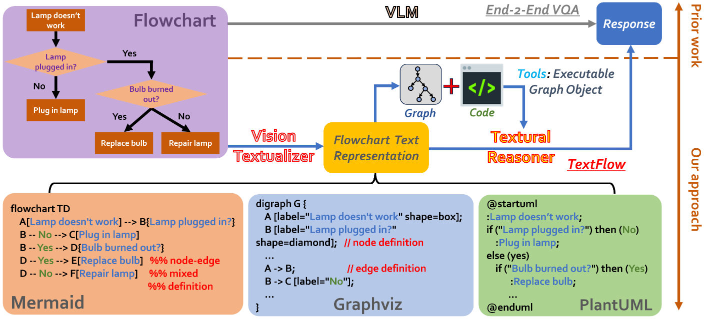

<p align="center">
     
</p>

# Beyond End-to-End VLMs: Leveraging Intermediate Text Representations for Superior Flowchart Understanding

[](https://arxiv.org/abs/2412.16420)



## News
- [2024/12] 🔥Excited to announce that our TextFlow paper is now available on [arXiv](https://arxiv.org/abs/2412.16420)!

## TL;DR
TEXTFLOW, a framework that converts flowchart images into text to improve explainability and control in flowchart understanding tasks.

## Abstract
Flowcharts are typically presented as images, driving the trend of using vision-language models (VLMs) for end-to-end flowchart understanding. However, two key challenges arise: (i) Limited controllability—users have minimal influence over the downstream task, as they can only modify input images, while the training of VLMs is often out of reach for most researchers. (ii) Lack of explainability—it is difficult to trace VLM errors to specific causes, such as failures in visual encoding or reasoning. 

We propose TextFlow, addressing aforementioned issues with two stages: (i) Vision Textualizer—which generates textual representations from flowchart images; and (ii) Textual Reasoner—which performs question-answering based on the text representations. TextFlow offers three key advantages: (i) users can select the type of text representations (e.g., Graphviz, Mermaid, PlantUML), or further convert them into executable graph object to call tools, enhancing performance and controllability; (ii) it improves explainability by helping to attribute errors more clearly to visual or textual processing components; and (iii) it promotes the modularization of the solution, such as allowing advanced LLMs to be used in the reasoner stage when VLMs underperform in end-to-end fashion. Experiments on the FlowVQA and FlowLearn benchmarks demonstrate TextFlow's state-of-the-art performance as well as its robustness. All code will be publicly released.

## Citation
If you find this project is helpful to your research, please consider to cite our paper:
```
@misc{ye2024endtoendvlmsleveragingintermediate,
      title={Beyond End-to-End VLMs: Leveraging Intermediate Text Representations for Superior Flowchart Understanding}, 
      author={Junyi Ye and Ankan Dash and Wenpeng Yin and Guiling Wang},
      year={2024},
      eprint={2412.16420},
      archivePrefix={arXiv},
      primaryClass={cs.CV},
      url={https://arxiv.org/abs/2412.16420}, 
}
```
